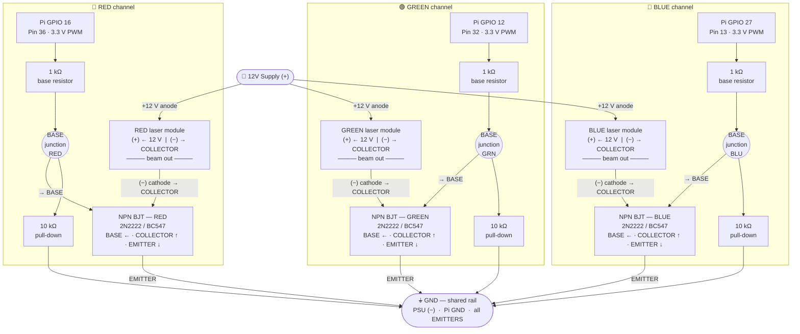

# RGB Laser Wiring — Pi 5 GPIO to 12V Laser Module

Three identical NPN low-side switch circuits, one per color channel. The Pi 5 drives each transistor base via a 1 kΩ resistor; the transistor switches the laser module's ground path. Active-HIGH logic: `GPIO HIGH (PWM duty=1.0) → transistor ON → laser ON`.



---

## Legend

| Symbol | Meaning |
|--------|---------|
| `PWR` | 12 V DC supply positive terminal |
| `GND` | Shared ground — connect PSU (−), Pi GND header pin, and all three transistor emitters here |
| `GPIO 16 / 12 / 27` | BCM-numbered Pi 5 GPIO pins (3.3 V, 10 kHz PWM from `master-laser.py`) |
| `1 kΩ base resistor` | Limits base current to ~2.6 mA — safe for Pi GPIO and sufficient to saturate NPN |
| `10 kΩ pull-down` | Holds BASE at GND when GPIO is floating (e.g. during Pi boot) — prevents spurious laser fire |
| `NPN BJT` | 2N2222A, BC547, 2N3904, or S8050 all work. Ic rating must exceed your laser module draw |
| `Laser module (+)/(−)` | Assumes module has built-in current limiting (KY-008-style). If using bare diodes, add a series resistor in the 12 V line |

## Active-HIGH logic (what the software expects)

```
GPIO HIGH (duty=1.0)  →  base current flows  →  transistor saturates  →  COLLECTOR–EMITTER short  →  laser grounds  →  LASER ON
GPIO LOW  (duty=0.0)  →  no base current     →  transistor off        →  no collector current    →  laser open     →  LASER OFF
```

## Do NOT use these GPIO pins (damaged on old board)

| Pin | Reason |
|-----|--------|
| GPIO 4 / 17 | Shorted to each other |
| GPIO 5 / 13 | Shorted to each other and to GND |
| GPIO 23 / 24 / 25 | Low resistance (~30–60 Ω) to adjacent pins |
| GPIO 20 | Pi 5 power button — do not use |

## Quick software test before connecting laser

```bash
# All three channels full-on (100% PWM):
python3 /home/admin/set_gpio_high.py

# All three channels off (0% PWM):
python3 /home/admin/set_gpio_low.py

# Cycle RED → GREEN → BLUE every 2 s:
python3 /home/admin/alternate_gpio.py
```
