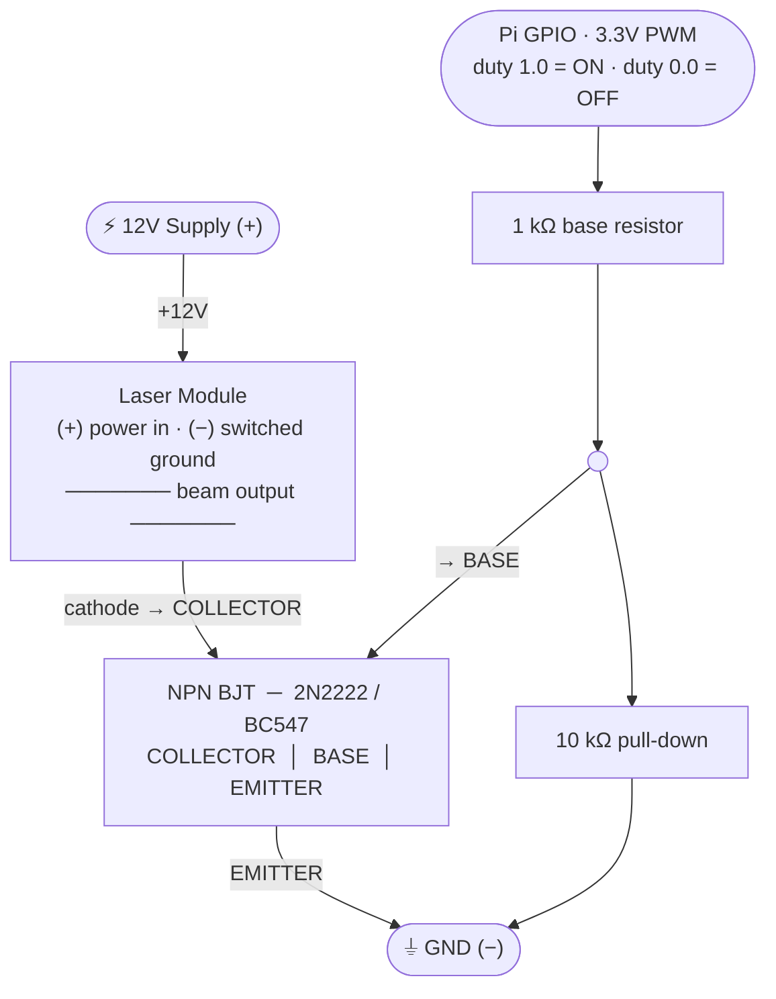

# RGB Laser Wiring — Single Channel (×3 identical)

**Pins:** GPIO 12 = RED (Pin 32) · GPIO 16 = GREEN (Pin 36) · GPIO 21 = BLUE (Pin 40) · GND = Pin 39

**⚠️ ACTIVE-LOW laser module:** control line 0V = color OFF · control line ~2.5V (floating) = color ON
- GPIO HIGH → transistor ON → control = 0V → **laser color OFF**
- GPIO LOW → transistor OFF → control = ~2.5V → **laser color ON**
- PWM duty in software is therefore **inverted**: duty=0.0 = full brightness, duty=1.0 = off
